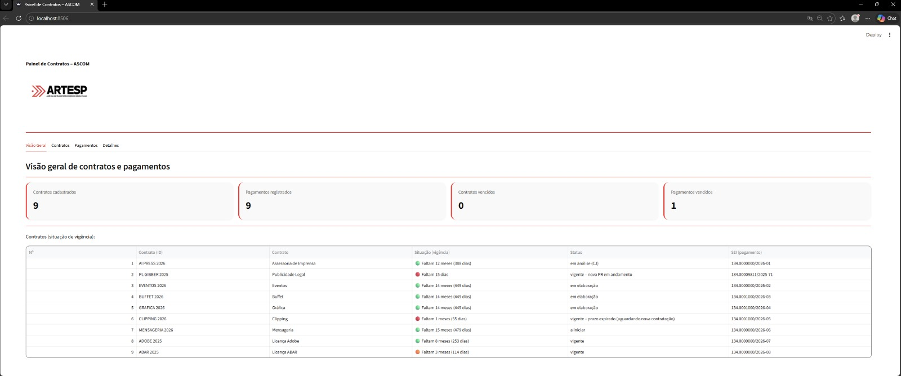

[](https://painel-contratos-ascom.streamlit.app)

# Painel de Contratos – ASCOM (ARTESP)

MVP para gestão de contratos e pagamentos da comunicação – ARTESP.

## 🎯 Objetivo
Centralizar o controle de:
- Vigência de contratos (alertas por prazo)
- Pagamentos (vencimentos, atrasos e status)
- Detalhes por contrato (fornecedor, contato, etc.)

## 🚀 Acesso ao aplicativo

O painel pode ser acessado online pelo link:

🔗 https://painel-contratos-ascom.streamlit.app

Aplicação hospedada no Streamlit Cloud.

## 🧱 Tecnologias
- Python
- Streamlit
- SQLite
- Pandas

## 🖼️ Print do painel


## ▶️ Como rodar localmente (Windows)
```bash
# 1) entrar na pasta
cd C:\Dev\ARTESP\painel_contratos

# 2) ativar venv
.\.venv\Scripts\activate

# 3) instalar dependências
pip install -r requirements.txt

# 4) criar banco (tabelas)
python database.py

# 5) (opcional) carregar dados fictícios (se existir seed)
# python seed.py

# 6) rodar o app
streamlit run app.py
